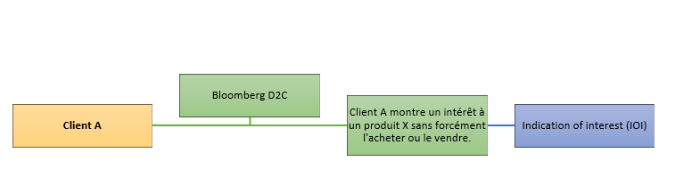

---
title:
  - "Analysis of a PhD thesis"
author: "Soukaina EL GHALDY"
date: "22 Janvier 2020"
output:
  pdf_document:
    toc: yes
  html_document:
    df_print: paged
    toc: yes
  word_document:
    toc: yes
---

\newpage

# 1. Synthèse
Dans sa thèse de doctorat, Baptiste Barreau souligne les difficultés rencontrées dans l’application du Machine Learning dans la prédiction des intérêts futurs des clients sur les marchés financiers. Dans ce travail, nous intéresserons particulièrement à son algorithme de ML : **Experts Network**.

## 1.1. Contexte financier

Dans cette thèse barreau utilise les données de la fameuse banque BNP Paribas. BNP Paribas CIB est un animateur de marché (en anglais *Market maker*) c’est une organisation qui va acheter et vendre d’importantes quantités d’actifs dans le but d'assurer la liquidité ainsi que le bon fonctionnement des marchés.

Par exemple, Un Market maker va proposer à un investisseur d’acheter 1 000 actifs financiers [^1] à 1 000€ chacune (cours vendeur/*Bid price*), et les offre ensuite à la vente pour 1 000,05€ (cours acheteur/*Ask price*). Bien que la différence soit de 0,05€, il est possible de réaliser d'importants bénéfices en vendant à plusieurs d’investisseurs. Donc le cœur de business du **Market dealer* est dans l’achat et la revente d’actifs tout en assurant l’équilibre des marchés. Mais les lois de l’offre et de la demande ne sont pas toujours justes.

Bien évidemment il peut arriver que notre teneur de marché ne puisse pas vendre tous les produits achetés et donc naturellement va devoir subir un coût de risque. C’est là, qu’interviennent les vendeurs (sales teams) qui vont minimiser ce coût en trouvant le plus rapidement des acheteurs. Un autre moyen, beaucoup plus efficace, que les acheteurs utilisent pour acquérir des produits de chez des teneurs de marché sont des logiciels spécialisés dans la matière comme **Bloomberg D2C** (*dealer to client*). Grâce à ce logiciel et leur rôle de régulateurs de marché, les dealers récupèrent plusieurs informations qui vont les aider à liquider leurs stocks d’«*axes*» [^2] . La première pièce
d’information est l’IOI. Elle représente la curiosité d’un client envers un
produit.

{width=100%}

La demande du produit X va légèrement augmenter. Les équipes commerciales (vendeurs & acheteurs) vont pouvoir enregistrer cette IOI dans leurs calcul de prédictions des intérêts futurs de leurs clients. Des processus d’achats ou de ventes potentiels vont être alors déclenchés.
Notre client A a parlé du produit X à son ami le client B. Cependant, celui-ci voudrait être informé de son prix dans un but d’achat dans la plateforme D2C. Notre client B va devoir faire un arbitrage entre deux diverticules:

+ Une *__Request for Quotation__* (RFQ) : qui est une sorte de demande de devis ou un appel d'offre par lequel un acheteur (ou un vendeur) va demander à l’animateur de marché de lui soumettre le prix auquel il souhaitera vendre (ou acheter) son produit X.

+ Une *__Request for Market__* (RFM) : va être plutôt une demande de prix d’achat (Bid price) et prix de vente (Ask price) du produit. Cette dualité est très avantageuse pour le client. Néanmoins légèrement onéreuse, car la subtilité entre une RFQ et une RFM est certes minime, mais bel et bien existante. Elle va être liée aux conventions dans le côté commercial de l’échange entre client et animateur.

{width=70%}

**N.B.** Pour les deux scénarios (RFQ ou RFM), uniquement les animateurs de marchés (ici : {1 et 2} ou {3}) seront informés du choix final du client B.

La problématique de cette thèse tourne autour d’une principale question qui est:

« **À une date t, quel investisseur est intéressé par l’achat/vente de quel actif financier ?**»

Baptiste BARREAU, nous accompagne tout au long des pages de sa thèse afin de créer des algorithmes qui répondront à cette question.

### 1.1.1. les instruments financiers 

Dans cette section, nous allons expliquer les instruments financiers nécessaires à la compréhension de cette thèse.

#### 1.1.1.1. Les obligations     

Une obligation est un titre financier de créance qui représente une fraction d'un emprunt émis par un Etat, une entreprise ou une collectivité. L'obligation est associée à un taux d'intérêt appelé "*Coupon*", qui va être payé annuellement par l'emmetteur. À l'échéance de l'obligation, le porteur est remboursé du capital investit à l'origine.

En france, ces valeurs mobilières ne sont pas directement détenues par des particuliers. Des intermédiaires professionnels comme l'assurance-vie ou les SICAV et fonds vont intervenir pour gérer l'épargne des particuliers.

{width=80%}

La date d'échéance de l'obligation est appelée la date de maturité (**maturity date**). À cette date, un **prix de remboursement** est dû par l'emprunteur. Cependant, il peut être inférieur ou supérieur à la valeur nominale (la valeur de coupure du capital en t0). La différence entre ces deux valeurs est appelée la prime de remboursement. Un dernier type de prix est le **prix à l'émission**. 

C'est "...le prix à payer pour acquérir une obligation à son émission. Si ce prix correspond à la valeur nominale de l’obligation, on dit que l’obligation est émise “**au pair**”. Certaines obligations sont émises à des prix inférieurs ou supérieurs à la valeur nominale".

Les taux d'intérêts des obligations sont définit annuellement. Tandis que les coupons sont souvent payés semestriellement. Dès lors, prenons une obligation A de 5ans, achetée à un prix d'émission de 3000€ et un taux d'intérêt annuel de 16%. Sa valeur à la première échéance (6mois) est de : 3000*(1 + 0.08) = 3240€. 

À la deuxième, il deviendra : 3000*1,08² = 3499,2€. Pour les 10 annuités nous
obtiendrons le shéma ci-dessous.

{width=100%}

Nous pouvons remarquer sur les 5 ans que la courbe a une tendance légèrement exponentielle.
Suite au calculs précédents nous pouvons conclure une formule générale de la valeur d'une obligation à un nombre d'années écroulées **n**, à périodicité **p** (dans l'exemple précédent, celle-ci prend la valeur de 2 par référence à 2 semestres par an), à un prix d'émission **Pe** et un taux d'intérêt annuel **Ir**.

L'équation :

\begin{equation}
  V_{(t=n)} = P_{e} * (1 + \frac{I_r}{p})^{np} \\
\end{equation}

Si nous appliquons la formule sur plusieurs périodicités. Nous remarquerons que la courbe deviendra de moins en moins linéaire et tendra vers une courbe à tendance exponentielle. Et donc plus il y a de périodicités, plus la valeur de l'obligation augmente. Nous appellons cet effet de la périodicité, le *Continuous Compounding*.

{width=50%}

Alors lorsque p tend à l'infini, notre précédente équation (1) va tendre vers:

\begin{equation}
  V_{(t=n)} = P_{e} * \exp^{n*I_r}\\
\end{equation}

#### 1.1.1.2. Options

Les options sont des contrats financiers (produits dérivés) qui permets d'acquérir le droit d'acheter ou de vendre une action à un prix convenu à une date précise (ou avant pour les Etats-Unis). Ce contrat peut être acheté ou vendu.

Il existe 2 types d'*Options* :

- **CALL option** : donne au détenteur le droit d'**acheter** des actions à un *prix convenu* à *une date précise*.

- **PUT option** : donne au détenteur le droit de **vendre** des actions à un *prix convenu* à *une date précise*.

Nous appelons le prix convenu pour l'achat ou la vente de l'action, *the strike price* et la date convenue *the expiration date*.

## 1.2. Les données

B. BARREAU a classé les différentes données à sa disposition de BNPP CIB en
3 catégories :

- Données liés aux clients : toutes les données recouvrables liées aux clients de la BNP Paribas CIB...

- Données liés aux actifs financiers : toutes les données recouvrables liées à l'identification des actifs ou l'analyse des actifs..

- Données liés aux opérations commerciales : toutes les données liées aux opérations d'achats ou de ventes d'actifs pouvant être recouvrables par la BNP autant que teneur de marché.

Dans une analyse de ces données, B. BARREAU explore ensuite les raisons de l'hétérogénéité des clients et des produits, parmis ces facteurs nous retrouvons :

- Des clients qui dévoilent pas leurs porte-feuille d'obligations.

- La majorité des opérations de ventes/achats de BNP Paris sont faites avec seulement une petite poignée de ses clients.

- Le manque de visuel sur l'ensemble de activités des clients (accès uniquement aux données des plateformes où la BNPP CIB est présente)

- L'existence de produits de niche qui font de l'ombre aux autres actifs

Comme nous le fait comprendre monsieur BARREAU, l'ensemble de ces facteurs font ressortir le problème "long tail"[^3](BARREAU, dans Park & Tuzhilin, 2008).

Dans notre contexte, l'utilisation de systèmes de recommendations qui vont proposer l'ensemble des actifs de notre portefeuille à certains clients ou au contraire, orienter l'ensemble de nos clients vers certains actifs n'est pas la meilleure solution.

Généralement, lorsque l'algorithme du "recommender systems" est abordé pour résoudre le problème du "long tail". Nous parlons d'un *recommender system* qui va favoriser la diversité des recommendations (en dehors des tendances habituelles des clients). Toutefois, ces divers nouvelles recommendations sont difficiles à évaluer à partir des données d'historique.

# 2. L'algorithme "Experts Network"

Dans ce chapitre, nous allons introduire un algorithme qui va répondre à la problématique de la thèse étudiée :

« **À une date t, quel investisseur est intéressé par l’achat/vente de quel actif financier ?**»

Cet algoritme prends la forme d'un réseau neuronal (en ang *Neural Network*) qui fera ressortir un regroupement supervisé (en ang *Supervised clustering*[^4] ) des investisseurs. Nous commencerons par examiner l’hétérogénéité des investisseurs et y introduirons une modélisation mathématique. Ensuite, nous engagerons l’architecture du réseau neuronal pour s’attaquer aux groupes hétérogènes d’investisseurs.

## 2.1. L'hétérogénéité des investisseurs

### 2.1.1. Explication du principe

L'hétérogénéité des investisseurs/actifs et l'état non-stationnaire des marchés financiers y rendent extrêmement difficile la prédiction des stratégies d'investissement adoptées par les clients.

Les RFQ datasets vont servir à fournir des informations sur les comportements de nos clients dans le marché. Nous nous attendons donc à ce qu’une collection de comportements hétérogènes émerge dans nos jeux de données RFQ. Il a été démontré que les méthodes ad hoc sont étonnamment efficaces pour regrouper les investisseurs en fonction de leurs transactions (achat/vente) d'un seul actif.

En outre, les groupes d’investisseurs déterminés par plusieurs actifs séparément représentent un chevauchement substantiel, ce qui montre qu’on peut être en mesure de regrouper les investisseurs pour plus de quelques actifs à la fois. L’activité d’une catégorie donnée peut également dépendre systématiquement de l’activité antérieure de certaines autres catégories, qui peut ensuite être utilisée pour prédire le flux d’investissement des investisseurs.

Ici, nous utiliserons le *Deep Learning*[^5] pour former un réseau neuronal pour tous les investisseurs et tous les actifs d’un marché donné et ensuite fournir des prédictions temporelles pour chaque investisseur, en suivant la stratégie du *content filtering*. Notre objectif est d'exploiter les données de ces groupes d’investisseurs, qui devraient suivre des stratégies de placement distinctes, afin d’améliorer les prévisions des investisseurs.

### 2.1.2. Modélisation mathématique

Nous définissons D comme l'ensemble des stratégies de placement distinctes qu'un investisseur pourrait choisir et appartennant à un groupe M (fictif) de l'ensemble des stratégies pouvant exister. D existe selon un mapping f qui va de x à y, où x est l'information actuelle et y l'expression d'intérêt à un achat ou une vente d'un actif.

{width=30%}

Le nombre de catégories (*clusters*) d'investisseurs est finie tel que |D| = K. Notre algorithme va devoir déduire l’ensemble des stratégies de placement D.

{width=30%}

## 2.2. The Neural network architecture

Ici nous introduisons un nouvel algorithme appelé *Experts Network* (ExNet). ExNet est conçu dans le but de suivre l'hypothèse formulée dans la section 2.1.2., et saisir un nombre fini K de stratégies d'investissements D.

2.2.1. Architecture du réseau

{width=100%}

Le réseau se compose de deux blocs :

- un "**gating block**" (bloc de synchronisation), composé d’un réseau neuronal indépendant dont le rôle est d’affecter les investisseurs aux différents groupes d'investisseurs(n) appelés "experts". Ces blocs reçoivent de différentes données d’entrée, indexées par le même triplet(Date, Client, Produit Financier).

Ce bloc reçoit une entrée distincte, l’entrée *gating input* correspondant à un encodage des investisseurs telle que le i-ème *gating input sample* soit lié au même investisseur que le i-ème *experts input sample*. Sa sortie se compose d’un vecteur de taille n, qui contient les probabilités que l’entrée soit allouée aux n experts, calculées par une *activation softmax*[^6].

Par exemple : (en Encodage one-hot)

[0,0,0,...,1,0,...,1,...,n]

- un "**expert block**" (bloc expert), composé de n sous-réseaux indépendants, appelés *experts*. Chaque *expert* reçoit en entrée les données des experts correspondant aux caractéristiques utilisées pour résoudre la tâche de clustering : pour une ligne donnée, l’intensité de la participation de l’investisseur dans l’actif financier pris en compte, le nombre total de RFQ réalisés par l’investisseur, le prix et la volatilité de l’actif...etc.

Comme les investisseurs sont envoyés aux experts par le biais du *gating block*, chaque expert apprendra une cartographie f qui correspond le mieux aux actions des investisseurs attribués. Par conséquent, le rôle d’un expert est de récupérer un **f(k)** donné, correspondant à l’un des groupes d’investisseurs sous-jacents K que nous avons supposé. Les résultats de ces deux blocs sont combinés par l'équation suivante :

{width=30%}

Notons que **a** désigne le critère de l'appartenance de l’investisseur à l’échantillon **x** et **p(i|a)** est la probabilité que l’investisseur **a** est affecté à l’expert **i**.

L'objectif est que l'ensemble des experts K apprennent à se spécialiser dans les clusters K. Comme K est inconnu, retrouver tous les clusters nécessite que n > ou = K. L’architecture décrite correspond en fait à une *méta-architecture*[^7].

Pour la simplicité et la facilité de calcul, nous utilisons ici le *small feed-forward*[^8] pour les réseaux neuronaux dans le bloc *experts*.

Pour un investisseur donné a, le bloc de contrôle calcule les probabilités d’attribution de l’investisseur **a** à chaque *expert* :

{width=40%}

Grâce à cette fonction (softmax[^9]), notre algoritme va pouvoir s'entrainer à calculer la probabilité que tel investisseur soit affecté à tel *expert*, et trouvant la plus grande probabilité, il est possible de prédire le comportement de cet investisseur.

\newpage

# Sources :

- (2018, 9 Janvier). Un actif financier. [Lafinancepourtous](https://www.lafinancepourtous.com/outils/dictionnaire/actif-financier/).

- AKHILESH GANTI. AG. (2019,13 Mai). Axe. [Investopedia](https://www.investopedia.com/terms/a/axe.asp).

- Request For Market (RFM). [Babypips](https://www.babypips.com/forexpedia/rfm).

- WILL KENTON. (WK). (2019, 22 Août). Two-Way Quote. [Investopedia](https://www.investopedia.com/terms/t/twowayquote.asp).

- WILL KENTON. (WK). (Review JULIUS MANSA. JM). (Update 2020, Nov. 1). Request
for Quote (RFQ). [Investopedia](https://www.investopedia.com/terms/r/request-for-quote.asp).

- Caractéristiques d’une obligation. [crédit & banque](https://www.credit-et-banque.com/caracteristiques-d-une-obligation/)

- (2020, 17 Sept.). Les différents types d’obligations. [lafinancepourtous](https://www.lafinancepourtous.com/decryptages/marches-financiers/produits-financiers/obligations/comprendre-les-obligations/les-differents-types-d-obligations/)

- continuous compounding formula. [wallstreetmojo](https://www.wallstreetmojo.com/continuous-compounding-formula/)

- Anderson, Chris (2006). [The Long Tail: Why the Future of Business Is Selling Less of More](https://books.google.fr/books?id=O2k0K1w_bJIC&redir_esc=y)

- Qu'est-ce que le deep learning ? [ netapp](https://www.netapp.com/fr/artificial-intelligence/what-is-deep-learning/).

## Quelques recommendations de lecture

Pour approfondir vos réflexions sur les sujets abordés, je me permets de vous
mettre à disposition quelques articles formateurs et/ou autres que j'ai jugée
intéressants.

- [Comprendre les obligations](https://www.lafinancepourtous.com/decryptages/marches-financiers/produits-financiers/obligations/comprendre-les-obligations/).

- [Les options: définition, usage, négociation, calcul de la valeur](https://www.fimarkets.com/pages/options.php).

- [Netflix data shows shifting demand down the Long Tail](https://longtail.typepad.com/the_long_tail/2009/09/netflix-data-shows-shifting-demand-down-the-long-tail.html).

[^1]: « Un actif financier est un titre ou un contrat, généralement négociable
sur un marché financier. Il y en a de très nombreuses sortes, des plus simples:
 actions, obligations, aux plus complexes : options, swaps, dérivés de crédit »
(lafinancepourtous, 2018)
[^2]: “An axe (or "axe to grind") is the interest that a trader shows in buying
or selling a security that is typically already on his books.” (A. GANTI, 2019)
[^3]: "The long tail strategy : The distribution and inventory costs of
businesses successfully applying a long tail strategy allow them to realize
significant profit out of selling small volumes of hard-to-find items to many
customers instead of only selling large volumes of a reduced number of popular
items."(longtail, wikipedia)
[^4]: "Supervised clustering is the task of automatically adapting
a clustering algorithm with the aid of a training set consisting of item sets
and complete partitionings of these item sets." (Thomas Finley & Thorsten
Joachim, *Supervised k-Means Clustering*)
[^5]: "Le deep learning est une branche du machine learning. Contrairement aux
algorithmes classiques du machine learning dont la capacité d'apprentissage est
limitée quelle que soit la quantité de données acquise, les systèmes de deep
learning peuvent améliorer leurs performances en accédant à davantage de
données : une machine plus expérimentée." (netapp.com)
[^6]:[How to use Softmax Activation function within a Neural Network](https://stackoverflow.com/questions/46713517/how-to-use-softmax-activation-function-within-a-neural-network).
[^7]: [Meta Data Architecture Fundamentals](https://tdan.com/meta-data-architecture-fundamentals/4968#:~:text=The%20key%20concept%20of%20a%20centralized%20meta%20data,of%20the%20meta%20data%20and%20stores%20it%20in).
[^8]:[An Introduction to Feedforward Neural Network: Layers, Functions & Importance](https://www.upgrad.com/blog/an-introduction-to-feedforward-neural-network/).
[^9]:[Réseaux de neurones à classes multiples : Softmax](https://developers.google.com/machine-learning/crash-course/multi-class-neural-networks/softmax?hl=fr).
