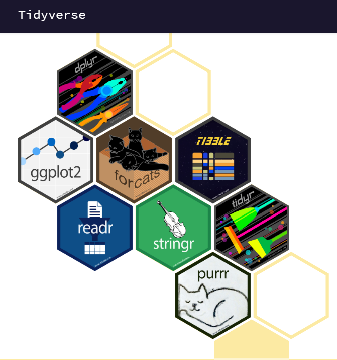

\newpage

## Introduction:  

Faisant partie des 7 packages de _tidyverse_, dplyr est un package dédié à la manipulation et l’exploration des données grâce à une grammaire diverse et variée. Le terme tidyverse est acourt pour "tidy universe" qui veut littéralement dire en anglais "Univers propre". D'où vient la philosphie de ce package. Ces extensions abordent un très grand nombre d’opérations courantes dans R parmi lesquelles nous trouverons:

+ La visualisation des données
+ La manipulation des tables de données
+ L'import et l'export de données
+ La manipulation des variables
+ L'extraction des données Web
+ La programmation 

>__Pourquoi choisir dplyr ?__

Il existe de nombreux packages R pour le traitement des données, mais dplyr a su s'imposer comme l'un des packages les plus efficaces et le plus utilisés de la communauté. Cela est principalement dû à trois raisons:

+ Sa rapidité. Ecrit principalement en C++, il permet de manipuler rapidement de grands volumes de données. 

+ La clarté et l’intuitivité de sa syntaxe. Il est souvent privilégié à  __data.frame__,car ce dernier est un peu moins "user friendly" et plutôt réservé aux utilisateurs avertis.

+ Son appartenance à l’ensemble de packages __tidyverse__ qui propose de nombreux packages très pratiques et qui fonctionnent bien ensemble, comme le célèbre __ggplot__ pour la représentation graphique des données.

## I. Installer Dplyr 

Il existe deux manières pour installer __dplyr__. Étant donné que __dplyr__ fait parti de __tidyverse__, il est possible de l’installer en même temps que les autres composantes de celui-ci. 

```{r eval=FALSE, include=FALSE}
install.packages("tidyverse")
```

Cette commande va en fait installer plusieurs extensions qui constituent le “coeur” du tidyverse, à savoir :

    + ggplot2 (pour la visualisation des données)
    + dplyr (pour la manipulation des données)
    + tidyr (pour la remise en forme des données)
    + purrr (pour la programmation)
    + readr (pour l'importation de données)
    + tibble (pour les tableaux de données)
    + forcats (pour les variables qualitatives)
    + stringr (pour les chaînes de caractères)

{width=40%}

Ou on peut aussi l’installer tout seul.
```{r eval=FALSE, include=TRUE}
install.packages("dplyr")
```

## II. Tidy data :

Le tidyverse est développé par Hardley Wickham dans un article de 2014 du __Journal of Statistical Software__. Ce package qui regroupe 7 autres packages et est fondé sur le concept de la "*tidy data*" ou la *donnée propre* en français. C'est un modèle basé sur la structure, le nettoyage et la préparation des données afin de faciliter leur analyse. Les principes d’un jeu de données tidy sont les suivants :

+ chaque variable est une colonne
+ chaque observation est une ligne
+ chaque type d’observation est dans une table différente

Définir et rendre des données tidy se fait avec l’extension tidyr. Les extensions du tidyverse, notamment ggplot2 et dplyr, sont prévues pour fonctionner avec des données tidy.

## III.L'objet tibble :  

Une autre particularité du tidyverse est que ces extensions (comme dplyr) travaillent avec des tableaux de données de format tibble, qui est une évolution plus moderne du classique data frame du R de base. Ce format est fourni est géré par l’extension 'tibble', qui fait partie du coeur du tidyverse. La plupart des fonctions des extensions du tidyverse acceptent des data frames en entrée, mais retournent un objet de classe tibble en sortie.

Contrairement aux data frames, les tibbles :

+ N’ont pas de noms de lignes

+ Autorisent des noms de colonnes invalides pour les data frames (espaces, caractères spéciaux, nombres…)

+ S’affichent plus intelligemment que les data frames : seules les premières lignes sont affichées, ainsi que quelques informations supplémentaires utiles (dimensions, types des colonnes…)

+ Ne font pas de 'partial matching' sur les noms de colonnes 

+ Affichent un avertissement si on essaie d’accéder à une colonne qui n’existe pas

Pour autant, les tibbles restent compatibles avec les data frames. On peut ainsi facilement convertir un data frame en tibble avec as_tibble : 

```{r eval=FALSE, include=TRUE}
as_tibble(mydataframe)
```

Mais aussi, on peut à tout moment convertir un tibble en data frame avec as.data.frame :
```{r eval=FALSE, include=TRUE}
as.data.frame(mytibble)
```

## IV. Manipuler vos données avec dyplr

dplyr est un package qui contient une grammaire de manipulation des données qui se fait grâce un nombre réduit de verbes, ceux-ci vous aideront à résoudre les défis les plus courants de la manipulation des données. Chaque verbe correspond à une action différente appliquée à un tableau de données. On y trouve principalement 6 verbes qui sont utilisés plus fréquemment :

+ Slice() 
+ Filter()
+ Select() 
+ Rename()
+ Arrange()
+ Mutate()

### 1. Slice()  

Le verbe __slice__ selectionne les lignes du tableau selon leur positions.Le premier argument va contenir le nom de la data frame et le deuxième un chiffre ou un vecteur de chiffres qui va positionner les lignes (observations) à extraire. 

Si on souhaite sélectionner la 10ème ligne de la table "data": 

```{r message=FALSE}
library(dplyr)
library(tibble)

data <- read.csv2("c:/Users/Soukaina/Documents/r_project/test.csv") 
data <- as_tibble(data) #Conversion en objet tibble

slice(data, 10)

```
Les données extraites sont en format tibble.

Si on veut sélectionner uniquement les 5 premières lignes :
```{r}
slice(data, 1:5)
```

__Arguments de slice () : *Documentation officielle*__

+ *.data* : A data frame, data frame extension (e.g. a tibble), or a lazy data frame (e.g. from dbplyr or dtplyr). See Methods, below, for more details.
        
+ *...* : For slice(): <data-masking> Integer row values.
        
Provide either positive values to keep, or negative values to drop. The values provided must be either all positive or all negative. Indices beyond the number of rows in the input are silently ignored.
For slice_helpers(), these arguments are passed on to methods.

+ *.preserve* : Relevant when the .data input is grouped. If .preserve = FALSE (the default), the grouping structure is recalculated based on the resulting data, otherwise the grouping is kept as is.

+ *n, prop* : Provide either n, the number of rows, or prop, the proportion of rows to select. If neither are supplied, n = 1 will be used.
           If n is greater than the number of rows in the group (or prop > 1), the result will be silently truncated to the group size. If the proportion of a group size is not an integer, it is rounded down.

+ *order_by* : Variable or function of variables to order by.

+ *with_ties* : Should ties be kept together? The default, TRUE, may return more rows than you request. Use FALSE to ignore ties, and return the first n rows.

+ *weight_by* : Sampling weights. This must evaluate to a vector of non-negative numbers the same length as the input. Weights are automatically standardized to sum to 1.

+ *replace* : Should sampling be performed with (TRUE) or without (FALSE, the default) replacement.

### 2. filter ()  

Le verbe _filter_ va sélectionner toutes les lignes (observations) d'une table qui respectent la condition définie. Pour être retenu la ligne doit renvoyer la valeur "TRUE" à chaque condition. Par exemple, si l'on veut sélectionner les personnes qui ont 46 ans, on peut filtrer sur la variable age de la manière suivante :

```{r}
filter(data,age == 46)
```

```{r echo=TRUE}
filter(data, age == 19)
```

Si on veut uniquement les personnes qui ont entre 70 et 80 ans (compris) :
```{r}
filter(data, age >= 70 & age <= 80)
```

Si on passe les conditions du côté des arguments, la commande va marcher. La commande précédente peut donc être écrite de la manière suivante, avec le même résultat :

```{r}
filter(data, age >= 70, age <= 80)
```


On peut également placer des fonctions dans les tests, qui nous permettent par exemple de sélectionner  les personnes les plus agées :
```{r}
filter(data, age == max(age))
```

__Arguments de filter() : *Documentation officielle*__

+ *.data* : A data frame, data frame extension (e.g. a tibble), or a lazy data frame (e.g. from dbplyr or dtplyr). See Methods, below, for more details.

+ *...* :  <data-masking> Expressions that return a logical value, and are defined in terms of the variables in .data. If multiple expressions are included, they are combined with the & operator. Only rows for which all conditions evaluate to TRUE are kept.

+ *.preserve* : Relevant when the .data input is grouped. If .preserve = FALSE (the default), the grouping structure is recalculated based on the resulting data, otherwise the grouping is kept as is.

### 3. Select() & Rename()  

Le verbe _select_ va permetrre d'extraire les colonnes d'un tableau de données. Ainsi, si on veut extraire les colonnes __name__ et __age__ du tableau *data* :

```{r}
select(data, name, age)
```

Si on fait précéder le nom de la colonne d’un -, la colonne est éliminée plutôt que sélectionnée :

```{r}
select(data,-name,-age)
```

__select__ comprend toute une série de fonctions facilitant la sélection de colonnes multiples. Par exemple, __starts_with__, __ends_width__, __contains__ ou __matches__ permettent d’exprimer des conditions sur les noms de variables :
```{r}
select(data, starts_with("couleur"))
```

La syntaxe colonne1:colonne3 permet de sélectionner toutes les colonnes situées entre colonne1 et colonne2 incluses :
```{r}
select(data, name:city)
```

Une variante de __select__ est __rename__, qui permet de renommer des colonnes. On l’utilise en lui passant des paramètres de la forme nouveau_nom = ancien_nom. Ainsi, si on veut renommer les colonnes __name__ et __city__ de *data* en __nom__ et __ville__ :

```{r}
data <- rename(data, nom = name, ville = city) #nous avons changé les noms des colonnes pour le reste 
print(data)
```

__Arguments de select() : *Documentation officielle*__  

+ *.data* : A data frame, data frame extension (e.g. a tibble), or a lazy data frame (e.g. from dbplyr or dtplyr). See Methods, below, for more details.

+ *...* : <tidy-select> One or more unquoted expressions separated by commas. Variable names can be used as if they were positions in the data frame, so expressions like x:y can be used to select a range of variables.

__Arguments de rename() : *Documentation officielle*__  

+ *.data* : A data frame, data frame extension (e.g. a tibble), or a lazy data frame (e.g. from dbplyr or dtplyr). See Methods, below, for more details.

+ *...* : For rename(): <tidy-select> Use new_name = old_name to rename selected variables.
For rename_with(): additional arguments passed onto .fn.

+ *.fn* : A function used to transform the selected .cols. Should return a character vector the same length as the input.

+ *.cols* : <tidy-select> Columns to rename; defaults to all columns.

### 4. Arrange()  

Souvent, il arrive qu’à la suite d’opérations de sélections (aussi bien de variables que de colonnes) que l’on souhaite ordonner les résultats selon un ordre bien précis. Ceci peut servir souvent en matière de visualisation ou même servir de base pour des sélections. Ainsi, si on veut trier le tableau *data* selon l'*age* croissant des personnes :
```{r}
arrange(data, age)
```

On peut trier selon plusieurs colonnes. Par exemple selon la *ville*, puis selon l'*age* :

```{r}
arrange(data, ville, age)
```
Si on veut trier selon une colonne par ordre décroissant, on lui applique la fonction desc() :

```{r}
arrange(data, desc(age))
```


Combiné avec __slice__, __arrange__ permet par exemple de sélectionner les trois personnes les plus jeunes :
```{r}
slice(arrange(data,age), 1:3)
```

__Arguments de arrange() : *Documentation officielle*__


+ *.data* : A data frame, data frame extension (e.g. a tibble), or a lazy data frame (e.g. from dbplyr or dtplyr). See Methods, below, for more details.

+ *...* : <data-masking> Variables, or functions or variables. Use desc() to sort a variable in descending order.

+ *.by_group* : If TRUE, will sort first by grouping variable. Applies to grouped data frames only.

### 5. Mutate()  

__mutate__ permet de créer de nouvelles colonnes dans le tableau de données, en général à partir de variables existantes.

Par exemple, la table *data* contient l'*age* d'un échantillon de personnes. Si on veut créer une nouvelle variable  avec __l'espérance de vie__ de ces personnes sachant qu'à l’échelle mondiale, l'espérance de vie est d'environ 72 ans, on peut faire :
```{r}
data <- mutate(data, esp = 72-age )
select(data, nom, esp)
```

On peut créer plusieurs nouvelles colonnes en une seule commande, et les expressions successives peuvent prendre en compte les résultats des calculs précédents. L’exemple suivant va prétendre que l'age des enfants de ces personnes va est calculable par rapport à leur espérance de vie *(en théorie !)* dans une variable "*age_enf*", puis utilisera cette nouvelle variable pour calculer leurs espérances de vie dans une nouvelle variable que nous appelerons "*esp_enf*".
```{r}
data <- mutate(data, 
                age_enf = esp/2,
                esp_enf = 72 - age_enf)
select(data, nom, age, esp, age_enf, esp_enf)
```

L’avantage d’utiliser mutate est double. D’abord il permet d’éviter d’avoir à saisir le nom du tableau de données dans les conditions. Ensuite, il permet aussi d’intégrer ces recodages dans un pipeline de traitement de données.

__Arguments de mutate() : *Documentation officielle*__


+ *.data* :	A data frame, data frame extension (e.g. a tibble), or a lazy data frame (e.g. from dbplyr or dtplyr). See Methods, below, for more details.

+ *...*	: <data-masking> Name-value pairs. The name gives the name of the column in the output.

The value can be:

A vector of length 1, which will be recycled to the correct length.

A vector the same length as the current group (or the whole data frame if ungrouped).

NULL, to remove the column.

A data frame or tibble, to create multiple columns in the output.

*.keep* : (Experimental lifecycle) This is an experimental argument that allows you to control which columns from .data are retained in the output:

"all", the default, retains all variables.

"used" keeps any variables used to make new variables; it's useful for checking your work as it displays inputs and outputs side-by-side.

"unused" keeps only existing variables not used to make new variables.

"none", only keeps grouping keys (like transmute()).

+ *.before, .after* :	(Experimental lifecycle) <tidy-select> Optionally, control where new columns should appear (the default is to add to the right hand side). See relocate() for more details.


## V. Autres fonctions et opérations

### 1. Enchaîner les opérations

Lorsque nous manipulons des données, il est très fréquent d'enchaîner plusieurs opérations à la fois. Par exemple pour extraire une sous-population avec __filter__, nous pouvons sélectionner des colonnes avec __select_ puis trier selon une variable avec __arrange__. 
Il est effectivement correcte d'enchaîner des opération comme ci-dessous :7
```{r}

arrange(select(filter(data, age == 46), nom, age), age)
```

Sauf que cette notation a plusieurs inconvénients:

+ Le manque de lisibilité
 
+ Les opérations apparaissent dans l’ordre inverse de leur réalisation. Ici on effectue d’abord le filter, puis le select, puis le arrange, alors qu’à la lecture du code c’est le arrange qui apparaît en premier.

+ Il est difficile de voir quel paramètre se rapporte à quelle fonction

Une autre manière de faire est d'utiliser un nouvel opérateur appelé __pipe__ pour simplifier et rendre le code plus lisible. Lepipe se note __%>%__, et son fonctionnement est le suivant : si j’exécute expr __%>%__ f, alors le résultat de l’expression expr, à gauche du pipe, sera passé comme premier argument à la fonction f, à droite du pipe, ce qui revient à exécuter f(expr).

```{r}
#Ainsi les deux expressions suivantes sont rigoureusement équivalentes :

filter(data, age == 46)

data %>% filter(age == 46)

```


### 2. Opérations de groupage

Il existe d'autres opérations avec dplyr qui vont avoir une fonction similaire au pipe (de groupage), mais qui seront très spécifique à notre package.

#### a. __groupby()__ :  

__group_by.__ permet de définir des groupes de lignes à partir des valeurs d’une ou plusieurs colonnes. Par exemple, on peut grouper les vols selon leur mois :
```{r}
data1 <- read.csv2("c:/Users/Soukaina/Documents/r_project/test1.csv") 
data1 <- as_tibble(data) #Conversion en objet tibble
data1 %>% group_by(age)
```

Par défaut ceci ne fait rien de visible, à part l’apparition d’une mention Groups dans l’affichage du résultat. Mais à partir du moment où des groupes ont été définis, les verbes comme slice, mutate ou summarise vont en tenir compte lors de leurs opérations.

Par exemple, si on applique slice à un tableau préalablement groupé, il va sélectionner les lignes aux positions indiquées pour chaque groupe. Ainsi la commande suivante affiche le premier vol de chaque mois, selon leur ordre d’apparition dans le tableau :
*Puisqu'il n'existe pas plus de 10 personnes qui ont le même age dans l'échantillon, nous allons comparer un slice du tableau où nous allons extraire les 10 premières personnes ayant le même age pour chaque groupe d'age et nous le comparerons avec le slice ci dessous*
```{r}
data1 %>% group_by(age) %>% slice(1:10) 
```

*Ce slice va indiquer dans l'ordre des clés (colonne des indexes), quel est la première personne de l'échantillon qui appartient à ce groupe d'ages. Par exemple, pour les personnes de l'échantillon ayant 25, ça va être Eden.*
```{r}
data1 %>% group_by(age) %>% slice(1) 
```

De la même manière,pour __mutate__ : les opérations appliquées lors du calcul des valeurs des nouvelles colonnes sont appliquées groupe de lignes par groupe de lignes. Dans l’exemple suivant, on ajoute une nouvelle colonne qui contient l'age moyen des habitants de chaque ville de cet échantillon. Le nombre de personne habitant une ville varie dans l'échantillon mais la moyenne par ville reste la même pour chaque personne :

```{r}
data1 %>% 
  group_by(ville) %>% 
  mutate(age_moy = mean(age, na.rm = TRUE)) %>% 
  select(ville, age_moy )
```

__Arguments de group_by() : *Documentation officielle*__

+ *.data* :	A data frame, data frame extension (e.g. a tibble), or a lazy data frame (e.g. from dbplyr or dtplyr). See Methods, below, for more details.

+ *...* :	In group_by(), variables or computations to group by. In ungroup(), variables to remove from the grouping.

+ *.add* : When FALSE, the default, group_by() will override existing groups. To add to the existing groups, use .add = TRUE.This argument was previously called add, but that prevented creating a new grouping variable called add, and conflicts with our naming conventions.

+ *.drop*	: Drop groups formed by factor levels that don't appear in the data? The default is TRUE except when .data has been previously grouped with .drop = FALSE. See group_by_drop_default() for details.

+ *x* :	A tbl() (a tibble)

#### b. __summarise()__  :

__summarise()__ permet d’agréger les lignes du tableau en effectuant une opération “résumée” sur une ou plusieurs colonnes. Par exemple, si on souhaite connaître les espérances de vie moyennes des personnes de notre échantillon et de leurs enfants:

```{r}
data1 %>% 
  summarise(esp_moy = mean(esp, na.rm=TRUE),
            esp_enf_moy = mean(esp_enf, na.rm=TRUE))
```

            
Cette fonction est en général utilisée avec group_by, puisqu’elle permet du coup d’agréger et résumer les lignes du tableau groupe par groupe. 
  
__Arguments de summarise() : *Documentation officielle*__

+ *.data* : A data frame, data frame extension (e.g. a tibble), or a lazy data frame (e.g. from dbplyr or dtplyr). See Methods, below, for more details.

+ *...* : 	
<data-masking> Name-value pairs of summary functions. The name will be the name of the variable in the result.
The value can be:
A vector of length 1, e.g. min(x), n(), or sum(is.na(y)).
A vector of length n, e.g. quantile().
A data frame, to add multiple columns from a single expression.

+ *.groups* :	Experimental lifecycle Grouping structure of the result.

"drop_last": dropping the last level of grouping. This was the only supported option before version 1.0.0.

"drop": All levels of grouping are dropped.

"keep": Same grouping structure as .data.

"rowwise": Each row is it's own group.

When .groups is not specified, it is chosen based on the number of rows of the results:

If all the results have 1 row, you get "drop_last".

If the number of rows varies, you get "keep".

In addition, a message informs you of that choice, unless the option "dplyr.summarise.inform" is set to FALSE, or when summarise() is called from a function in a package.

## Conclusion 

Jusque là, nous avons vu que les bases qui vont vous permettre de comprendre le package dplyr. Dplyr contient beaucoup plus de fonctions utiles pour la manipulation de données comme : count(), slice_sample(), slice_head(), slice_tail(), slice_min(), slice_max(),lead(), lag(), distinct(), n_distinct(), relocate()... etc. En vous familiarisant avec ces fonctions vous allez pouvoir enrichir encore plus votre syntaxe dplyr. Vous allez ensuite pouvoir vous penchez vers la concaténation des colonnes et lignes de plusieurs tables ou encore les jointures entre tables, vous deviendrez alors les Masters de dplyr! 

Dans l'espoir que ce rapport d’introduction à la manipulation des données sous R avec dplyr vous aura, à la fois, convaincu de la facilité d’utilisation du package dplyr et de ses grandes possibilités. J’espère aussi qu'il permettra, à ceux qui n’utilisent pas encore ce package, de franchir le pas. A mon sens, lorsqu’on fait de l’analyse de données avec R, il est tout aussi important de savoir utiliser le package dplyr que les autres packages de tidyverse comme ggplot2.


*Please find attached to this document a cheat sheet that will help you master dplyr !*

\newpage

## Sitographie :

+ https://www.rdocumentation.org/packages/dplyr/versions/0.7.8
+ https://dplyr.tidyverse.org/
+ https://www.rdocumentation.org/packages/tibble/versions/3.0.4/topics/as_tibble
+ https://demandred.gitbooks.io/introduction-a-r-pour-les-chatons/content/les-tibbles-less-is-more.html
+ https://delladata.fr/guide-de-demarrage-en-r-markdown/
+ https://atlasocio.com/classements/sante/vie/classement-etats-par-esperance-de-vie-monde.php
+ https://rstudio.com/resources/cheatsheets/
+ https://juba.github.io/tidyverse/10-dplyr.html#ressources-2
+ https://r4ds.had.co.nz/introduction.html
+ https://bookdown.org/fousseynoubah/dswr_book/transformer-de-donnees-avec-dplyr.html
+ https://campus.datacamp.com/courses/data-manipulation-with-dplyr/transforming-data-with-dplyr?ex=1
+ https://dplyr.tidyverse.org/reference/slice.html
+ https://tibble.tidyverse.org/reference/tibble.html
