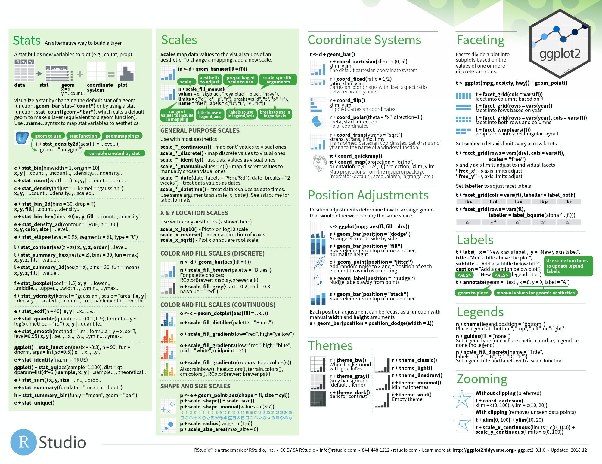

```{r setup, include=FALSE}
knitr::opts_chunk$set(echo = TRUE)
library(ggplot2)
```
Ce Tuto décrit comment créer un nuage de point avec le package ggplot2 


# Préparer les données

Le jeu de données mtcars est utilisé dans les exemples ci-dessous


```{r}
# convertir la colonne cyl envariable de type facteur
mtcars$cyl <- as.factor(mtcars$cyl)
head(mtcars)
```

# Nuage de points simples

Des nuages de points simples sont créés en utilisant le code de R ci-dessous. La couleur, la taille et la forme des points peuvent être modifiées en utilisant la fonction `geom_point()` comme suit:
`geom_point(size, color, shape)`

```{r}
#Nuage de points simple
ggplot(mtcars, aes(x=wt, y=mpg)) + geom_point()
# Changer la taille et la forme
ggplot(mtcars, aes(x=wt, y=mpg)) +
  geom_point(size=2, shape=23)
```

```{r}
# Changer la taille des points
ggplot(mtcars, aes(x=wt, y=mpg)) + 
  geom_point(aes(size=qsec))
```
<br>

# Annoter les points

<br>
La fonction `geom_text()` peut être utilisée : 

<br>
```{r}
ggplot(mtcars, aes(x=wt, y=mpg)) +
  geom_point() + 
  geom_text(label=rownames(mtcars))
```
<br>

## Ajouter des lignes de regression 

<br>
Les fonctions ci-dessous peuvent être utilisées pour ajouter des droites de régression à un nuage de points:<br>
  * `geom_smooth()` et `stat_smooth`<br>
  * `geom_abline()`
<br> Seule la fonction `geom_smooth()` est couverte dans cette section.

Un format simplifié est:
`geom_smooth(method="auto", se=TRUE, fullrange=FALSE, level=0.95)`

> * `method` :  méthode à utiliser pour estimer la tendance moyenne. Les valeurs possibles sont lm, glm, gam, loess, rlm.<br>
  * `se` :  valeur logique. Si TRUE, l’intervalle de confiance est affichée autour de la moyenne.<br>
  * `fullrange` :  valeur logique. Si TRUE, la courbe moyenne couvre le graphique en entier.<br>
  * `level` :  niveau de l’intervalle de confiance à utiliser. La valeur par défaut est de 0,95.<br>

```{r}
# Ajouter la droite de regression
ggplot(mtcars, aes(x=wt, y=mpg)) + 
  geom_point()+
  geom_smooth(method=lm)
# Supprimer l'intervalle de confiance
ggplot(mtcars, aes(x=wt, y=mpg)) + 
  geom_point()+
  geom_smooth(method=lm, se=FALSE)
# La méthode "Loess"
ggplot(mtcars, aes(x=wt, y=mpg)) + 
  geom_point()+
  geom_smooth()
```
<br>

## Changer l'apparence des points et des traits

<br>
Cette section décrit comment modifier:<br>
  *la couleur et la forme des points<br>
  *le type de trait et la couleur de la droite de régression<br> 
  *la couleur de remplissage de l'intervalle de confiance<br>
  
```{r}
# Changer la couleur et la forme des points
# Changer le type de trait et la couleur
ggplot(mtcars, aes(x=wt, y=mpg)) + 
  geom_point(shape=18, color="blue")+
  geom_smooth(method=lm, se=FALSE, linetype="dashed",
             color="darkred")
# Changer la couleur de remplissage de l'intervalle de confiance
ggplot(mtcars, aes(x=wt, y=mpg)) + 
  geom_point(shape=18, color="blue")+
  geom_smooth(method=lm,  linetype="dashed",
             color="darkred", fill="blue")
```
<br>

# Nuage de points avec plusieurs groupes 

<br>

Cette section décrit comment changer les couleurs et les types de points automatiquement et manuellement.<br>

## Changer la couleur, le type, la taille des points automatiquement 

<br>

```{r}
# Changer le type de points en fonction des niveaux de cyl
ggplot(mtcars, aes(x=wt, y=mpg, shape=cyl)) +
  geom_point()
# Changer le type et la couleur
ggplot(mtcars, aes(x=wt, y=mpg, shape=cyl, color=cyl)) +
  geom_point()
# Changer le type, la couleur et la taille
ggplot(mtcars, aes(x=wt, y=mpg, shape=cyl, color=cyl, size=cyl)) +
  geom_point()
```
<br>

## Ajouter des droites de régression 

<br>

```{r}
# Ajouter des lignes de régression
ggplot(mtcars, aes(x=wt, y=mpg, color=cyl, shape=cyl)) +
  geom_point() + 
  geom_smooth(method=lm)
# Supprimer les intervalles de confiance
# Etendre les droites de régression
ggplot(mtcars, aes(x=wt, y=mpg, color=cyl, shape=cyl)) +
  geom_point() + 
  geom_smooth(method=lm, se=FALSE, fullrange=TRUE)
```
<br>
Les couleurs de remplissage des intervalles de confiances peuvent être changées comme suit:
<br>
```{r}
ggplot(mtcars, aes(x=wt, y=mpg, color=cyl, shape=cyl)) +
  geom_point() + 
  geom_smooth(method=lm, aes(fill=cyl))
```

## Changer la couleur, le type, la taille des points manuellement 

<br>

```{r}
# Changer le type de points et la couleur manuellement
ggplot(mtcars, aes(x=wt, y=mpg, color=cyl, shape=cyl)) +
  geom_point() + 
  geom_smooth(method=lm, se=FALSE, fullrange=TRUE)+
  scale_shape_manual(values=c(3, 16, 17))+ 
  scale_color_manual(values=c('#999999','#E69F00', '#56B4E9'))+
  theme(legend.position="top")
  
# Changer la taille des points manuellement
ggplot(mtcars, aes(x=wt, y=mpg, color=cyl, shape=cyl))+
  geom_point(aes(size=cyl)) + 
  geom_smooth(method=lm, se=FALSE, fullrange=TRUE)+
  scale_shape_manual(values=c(3, 16, 17))+ 
  scale_color_manual(values=c('#999999','#E69F00', '#56B4E9'))+
  scale_size_manual(values=c(2,3,4))+
  theme(legend.position="top")
```
<br>

Il est également possible de modifier manuellement la couleur des points et des traits en utilisant les fonctions:<br>
  * `scale_color_brewer()` : pour utiliser les palettes de couleurs du package RColorBrewer<br>
  * `scale_color_grey()` : pour utiliser les palettes de couleurs grises<br>

```{r}
p <- ggplot(mtcars, aes(x=wt, y=mpg, color=cyl, shape=cyl)) +
  geom_point() + 
  geom_smooth(method=lm, se=FALSE, fullrange=TRUE)+
  theme_classic()
# Utiliser les palettes brewer
p+scale_color_brewer(palette="Dark2")
# Utiliser les couleurs grises
p + scale_color_grey()
```
<br>

# Ajouter la densité marginale

<br>La fonction `geom_rug()` peut être utilisée:
<br>`geom_rug(sides ="bl")`

<br>`sides` : côté sur lequel il faudrait ajouter la densité. La valeur possible est une chaîne de caractère contenant l’un des éléments “trbl”, pour top (haut), right (droite), bottom (bas), et left (gauche).
<br>
```{r}
# Ajouter la densité marginale
ggplot(mtcars, aes(x=wt, y=mpg)) +
  geom_point() + geom_rug()
# Changer les couleurs
ggplot(mtcars, aes(x=wt, y=mpg, color=cyl)) +
  geom_point() + geom_rug()
# Utiliser le jeu de données faithful
ggplot(faithful, aes(x=eruptions, y=waiting)) +
  geom_point() + geom_rug()
```
<br>

# Nuage de pointsavec estimation de la densité 2d

<br>
Les fonctions `geom_density2d()` ou `stat_density2d()` peuvent être utilisées:
<br>
```{r}
# Nuage de points avec estimation de la densité 2d
sp <- ggplot(faithful, aes(x=eruptions, y=waiting)) +
  geom_point()
sp + geom_density2d()
# Gradient de couleur
sp + stat_density2d(aes(fill = ..level..), geom="polygon")
# Changer le gradient de couleur
sp + stat_density2d(aes(fill = ..level..), geom="polygon")+
  scale_fill_gradient(low="blue", high="red")
```
<br>

# Nuage de points avec ellipse 

<br>
La fonction `stat_ellipse()` peut être utilisée comme suit:
<br>
```{r}
# Une ellipse autour de tous les points
ggplot(faithful, aes(waiting, eruptions))+
  geom_point()+
  stat_ellipse()
# Ellipses par groupes
p <- ggplot(faithful, aes(waiting, eruptions, color = eruptions > 3))+
  geom_point()
p + stat_ellipse()
# Changer le type d'ellipses: 
# Valeurs possibles "t", "norm", "euclid"
p + stat_ellipse(type = "norm")
```
<br>

# Nuage de point avec distribution marginale

<br>

## Step 1/3 Créer des données:

```{r}
set.seed(1234)
x <- c(rnorm(500, mean = -1), rnorm(500, mean = 1.5))
y <- c(rnorm(500, mean = 1), rnorm(500, mean = 1.7))
group <- as.factor(rep(c(1,2), each=500))
df <- data.frame(x, y, group)
head(df)
```
<br>

## Step 2/3 Créer des graphiques

```{r}
# Nuage de points colorés par groupes
scatterPlot <- ggplot(df,aes(x, y, color=group)) + 
  geom_point() + 
  scale_color_manual(values = c('#999999','#E69F00')) + 
  theme(legend.position=c(0,1), legend.justification=c(0,1))
scatterPlot
# Courbe de densité marginale de x (panel du haut)
xdensity <- ggplot(df, aes(x, fill=group)) + 
  geom_density(alpha=.5) + 
  scale_fill_manual(values = c('#999999','#E69F00')) + 
  theme(legend.position = "none")
xdensity
# Courbe de densité marginale de y (panel de droite)
ydensity <- ggplot(df, aes(y, fill=group)) + 
  geom_density(alpha=.5) + 
  scale_fill_manual(values = c('#999999','#E69F00')) + 
  theme(legend.position = "none")
ydensity
```
<br>
Créer un emplacement vide :
<br>
```{r}
blankPlot <- ggplot()+geom_blank(aes(1,1))+
  theme(plot.background = element_blank(), 
   panel.grid.major = element_blank(),
   panel.grid.minor = element_blank(), 
   panel.border = element_blank(),
   panel.background = element_blank(),
   axis.title.x = element_blank(),
   axis.title.y = element_blank(),
   axis.text.x = element_blank(), 
   axis.text.y = element_blank(),
   axis.ticks = element_blank()
     )
```

<br>

## Step 3/3 Regrouper les graphiques:

<br>Pour mettre plusieurs graphiques sur la même page, le package `gridExtra` peut être utilisé. 
<br>Arranger le graphique avec des largeurs et des hauteurs adaptées pour chaque ligne et chaque colonne:
<br>
```{r}
library(gridExtra)
grid.arrange(xdensity, blankPlot, scatterPlot, ydensity, 
        ncol=2, nrow=2, widths=c(4, 1.4), heights=c(1.4, 4))
```
<br>

# Nuages de points personnalisés

<br>
```{r}
# Nuage de points simple
ggplot(mtcars, aes(x=wt, y=mpg)) + 
  geom_point()+
  geom_smooth(method=lm, color="black")+
  labs(title="Miles per gallon \n according to the weight",
       x="Weight (lb/1000)", y = "Miles/(US) gallon")+
  theme_classic()  
# Changer la couleur/ le type par groupe
# Supprimer l'intervalle de confiance
p <- ggplot(mtcars, aes(x=wt, y=mpg, color=cyl, shape=cyl)) + 
  geom_point()+
  geom_smooth(method=lm, se=FALSE, fullrange=TRUE)+
  labs(title="Miles per gallon \n according to the weight",
       x="Weight (lb/1000)", y = "Miles/(US) gallon")
p + theme_classic()
```
<br>
Changer les couleurs manuellement
<br>
```{r}
# Couleurs continues
p + scale_color_brewer(palette="Paired") + theme_classic()
# Couleurs discrètes
p + scale_color_brewer(palette="Dark2") + theme_minimal()
# Couleurs en gradient
p + scale_color_brewer(palette="Accent") + theme_minimal()
```
<br>

# ggplot Cheat sheet




